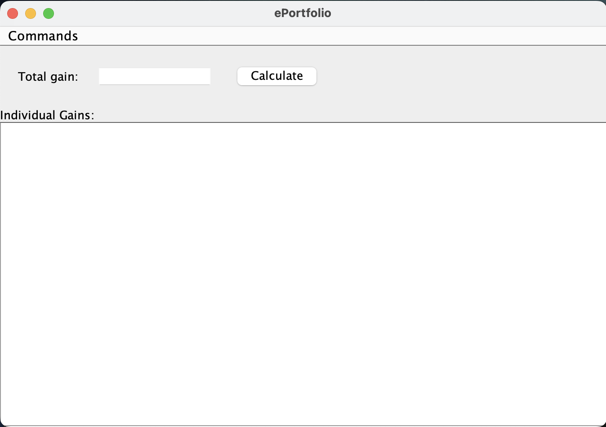

WELCOME TO ELECTRONIC PORTFOLIO

**(1) General Problem and Software Functionalities**
    This program simulates an investment portfolio management system that handles simple buy, sell, update, and search functionalities for stocks and mutual funds. Practice trading strategies risk-free. 

**Software Functionalities:**
    Buy Investments: Users can purchase stocks or mutual funds by specifying the asset type, symbol, name, quantity, and price.
    Sell Investments: Users can sell a certain quantity of their investments at a specified price.
    Update Investment Prices: Users can update the prices of all investments in their portfolio.
    Calculate Total Gain: The software calculates the total gain or loss of the portfolio based on its current price.
    Search Investments: Users can search for investments based on symbol, keywords in the name, and price ranges, or all of them combined. Uses hashmaps for 
    fastness.
    Save to file and load to files.
    This software makes portfolio management better, making a cumbersome and tedious process manageable through a few simple operations.
    
**(2) User Guide**
    Make the Program:
    Environment: YOU NEED JDK version 8 or higher is installed. AND ALSO java 17.
    The jar file should already exist. If not:

**A. Compilation and Execution within terminal:**
    Compilation: javac -d bin src/ePortfolio/*.java
    Execution: java -cp bin ePortfolio.GUI

**B. Creation of a new JAR file.**
    First compile: javac -d bin src/ePortfolio/*.java
    create jar file: jar cfm ePortfolio.jar manifest.txt -C bin/ . resources/ lib/
    execute jar file: java -jar ePortfolio.jar OR simply double click the jar file.
    Note: for OPTION B make sure manifests.txt includes Main-Class: ePortfolio.GUI and has a newline after that. 
    
**Screenshots**
    
    
    
    
    
    

**File Contents:**
    src contains all the .java files:
        Portfolio.java: Contains the Portfolio class with methods to manage investments.
        Main.java: Contains the main method for running the application.
        Stock.java: Defines the Stock class representing stock investments.
        MutualFund.java: Defines the MutualFund class representing mutual fund investments.
        Investment.java: A superclass for all types of investments, including stocks and mutual funds, to simplify code by reducing redundancy.
    lib contains the file "investments.txt" for saving and retrieving user game information.
    bin contains all the .class files.
    resources contains images.
    docs contains screenshots. 

**(3) Assumptions and Limitations**
**Assumptions:**
    Unique and Correct Symbols: Every stock and mutual fund is uniquely identified by its symbol.
    Commission and Fees: Stocks have a commission of $9.99 for both buying and selling, while mutual funds don’t have a commission but have a $45 redemption 
    fee when sold.
    Case-Insensitive Symbols: The software assumes symbols are case-insensitive.

**Limitations:**
    Hardcoded Fees: The program hardcodes the $9.99 commission for stocks and the $45 fee for mutual funds, which may not match different brokerage fees.
    No real-time price updates: Users must manually update stock or mutual fund prices.
    No check on whether the investment exists requires api.
    Limited Investment Types: The program only handles stocks and mutual funds. Other types of investments (like bonds, ETFs, etc.) are not supported.
    Outdated GUI (java swing)..
    No Database Used: The program relies on  text files for data storing and retreiving, which limits scalabnility and other capabilities..

**(4) Test Plan**

**A. Welcome Page**
    Open the program and check if the welcome message and instructions show up.
    Make sure the menu has these options:
        Buy Investment
        Sell Investment
        Update Investments
        Get Total Gain
        Search Investments
        Quit
    Check if the current balance is shown.
    Test the "Set New Balance" button:
        Enter a number between 0 and 1,000,000. Balance should update.
        Enter a wrong value (like numbers outside the range or letters). An error message should show.
    Test the "Reset Game" button:
        It should reset all data and set the balance to zero.
    Make sure the program loads data from the file (`lib/investments.txt`) when it starts and saves data to the file when the balance changes.

**B. Buy Investment**
    Pick "Buy Investment" from the menu. Check if these fields are there:
        Type (dropdown with "Stock" and "Mutual Fund," default is "Stock").
        Symbol, Name, Quantity, and Price (text fields).
    Test the "Buy" button:
        Enter correct values (positive quantity and price). It should add or update the investment.
        Enter wrong values (negative, zero, or blank). An error message should show.
    Make sure:
        Buying stocks adds a $9.99 fee.
        Buying mutual funds does not add a fee.
        The same symbol cannot be used for both a stock and a mutual fund.
    Test the "Reset" button. It should clear all fields.
    Make sure the program saves the portfolio to the file after buying.

**C. Sell Investment**
    Pick "Sell Investment" from the menu. Check if these fields are there:
        Symbol (text field).
        Quantity (text field).
        Price (text field).
    Test the "Sell" button:
        Enter correct values. It should reduce the quantity or remove the investment.
        Enter wrong values (more than you own, zero, or negative). An error message should show.
    Make sure:
        Selling stocks subtracts a $9.99 fee.
        Selling mutual funds subtracts a $45 fee.
    Test the "Reset" button. It should clear all fields.
    Make sure the program saves the portfolio to the file after selling.

**D. Update Investments**
    Pick "Update Investments" from the menu. Check these fields:
        Symbol and Name (cannot be edited).
        Price (can be edited).
    Use "Prev" and "Next" buttons to move through investments:
        Buttons should be disabled if there is no previous or next investment.
    Test the "Save" button:
        Enter correct prices to update.
        Enter wrong prices (zero or negative). An error message should show.
    Make sure the changes save correctly and the portfolio is saved to the file.

**E. Get Total Gain**
    Pick "Get Total Gain" from the menu.
    Check that:
        The total gain shows in a box that cannot be edited.
        Details for each investment show in a scrollable box.
    Make sure:
        Gains include $9.99 fees for stocks and $45 fees for mutual funds.
        Total gain updates with the latest prices.

**F. Search Investments**
    Pick "Search Investments" from the menu. Check these fields:
        Symbol (text field).
        Name Keywords (text field).
        Low Price and High Price (text fields).
    Test the "Search" button:
        Leave all fields empty to see all investments (wildcard search).
        Enter one field (like symbol or keyword) and check the results.
        Use more than one field to narrow the search.
        Enter wrong price ranges (negative or low price higher than high price). An error message should show.
    Test the "Reset" button. It should clear all fields and results.

**(5) Possible Improvements**
    a. Replace file-based storage with a relational database, which can help with info retrieval, and storage, and can help with search functions.
    b. Develop a more modern GUI using JavaFX or javascript or web-based interface to improve accessibility and user experience. 
    c. Dynamic Fees and Commissions:  Because every brokerage has different rates we should not hardcode fees and have an option to set them. 
    d. Real-time Data: use an api to fetch live stock/mutual fund prices, saving users from manually entering prices which is a hassle.
    e. Include other investments like bonds, ETFs, and cryptocurrencies. THere are many kind of investments
    f. Make a web app with Java Spring Boot where users can create accounts, log in, and manage their own investment portfolios.

